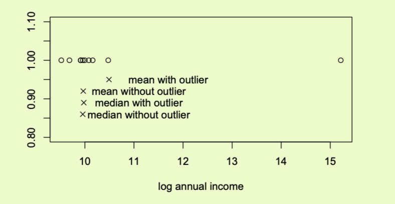
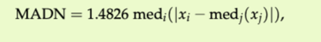

# 1

2.1 稳健统计 所有的统计方法都依赖于一些假设。通常会出现两种类型的假设。分布假设假设观测值是由特定的分布产生的，通常是高斯分布。例如，经典的线性最小二乘回归假设误差是方差不变的正态分布。其次，即使不需要这样一个明确的分布，经典的统计方法也依赖于假设所有的观测值都是由同一个基本过程产生的。然而，在许多现实生活中的应用中，人们观察到数据集包含一些非典型的观测值，称为异常值。这些观测值偏离了数据中的主要模式，经典的统计方法往往对离群值非常敏感。一些偏离的观测值会对结果产生巨大的影响。稳健统计学构建的估计器可以控制离群值的影响。一般来说，当没有异常值时，稳健方法会给出与经典估计类似的结果，但当出现异常值时，会不断给出适当的结果。

S^2  为啥n-1 -无偏估计

#### median absolute deviation (MAD)

