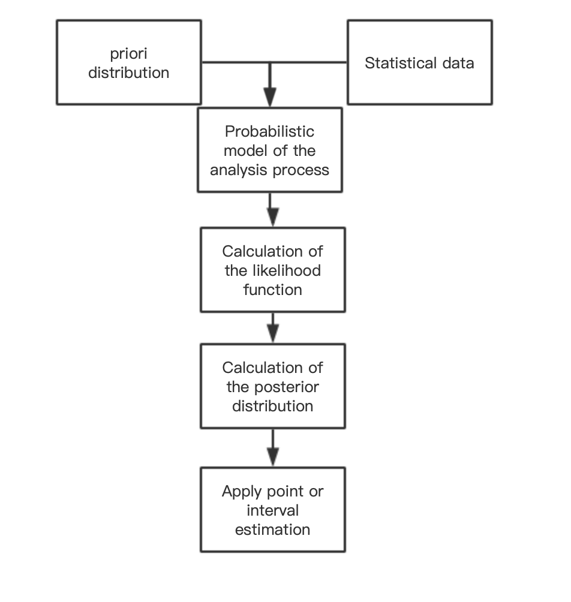

# Bayesian analysis and small samples

 

In terms of parameter estimation and prediction, the bayesian approach takes into account not only the statistics, but also the available prior information, thus requiring a smaller sample size than the classical one, and the use of the bayesian approach gives an important property of the obtained statistical solution - robustness (resistance to model distortions)

## What is Bayesian Analysis

Bayesian inference derives the posterior probability as a result of two premises: a prior probability and the data observed by the "likelihood function from the derived" statistical model. Bayesian inference calculates the posterior probabilities according to Bayes' theorem.

$$\begin{equation}
P(H \mid E)=\frac{P(E \mid H) \cdot P(H)}{P(E)}
\end{equation}$$

- P(H) is the prior probability, understood as the prior likelihood

- P(H|E) the posterior probability, updated likelihood value based on the observed sample

- P(E|H) the likelihood function, the likelihood of E obtained conditional on H

  

## Bayesian Inference

- $x$, It's usually a data point. In fact, it may be a carrier of value.
- $\theta$, parameter of the data point distribution, i.e., $x \sim p(x \mid \theta)$ . In fact, this could be the vector of parameters.
-  $\alpha$, hyperparameters of the parameter distribution, i.e., $\theta \sim p(\theta \mid \alpha)$ . In fact, this could be the vector of hyperparameters.
- $\mathbf{X}$ is the sample, a set of $n$ observed data points, i.e. $x_{1}, \ldots, x_{n} . $
- $\tilde{x}$, A new data point whose distribution will be predicted.

$p(\theta \mid \mathbf{X}, \alpha)=\frac{p(\theta, \mathbf{X}, \alpha)}{p(\mathbf{X}, \alpha)}=\frac{p(\mathbf{X} \mid \theta, \alpha) p(\theta, \alpha)}{p(\mathbf{X} \mid \alpha) p(\alpha)}=\frac{p(\mathbf{X} \mid \theta, \alpha) p(\theta \mid \alpha)}{p(\mathbf{X} \mid \alpha)} \propto p(\mathbf{X} \mid \theta, \alpha) p(\theta \mid \alpha)$

Here the posterior is proportional to the prior multiplied by the likelihood function, the

## Bayesian prediction

The distribution of the posterior distribution new data points, so the marginalization of the posterior distribution

$p(\tilde{x} \mid \mathbf{X}, \alpha)=\int p(\tilde{x} \mid \theta) p(\theta \mid \mathbf{X}, \alpha) \mathrm{d} \theta$

A priori predictive distribution is a new distribution of data points that marginalizes the prior.

$p(\tilde{x} \mid \alpha)=\int p(\tilde{x} \mid \theta) p(\theta \mid \alpha) \mathrm{d} \theta$

Bayesian theory requires predictive inference using posterior predictive distributions, i.e., predicting the distribution of new, unobserved data points. That is, instead of fixed points as predictions, the distribution over the possible points is returned. Only then can the entire posterior distribution of the used parameters be used

## Parameter estimation

It is usually expected to use the posterior distribution to estimate parameters or variables.Several methods of Bayesian estimation select measurements of central tendency from the posterior distribution. The posterior median is usually chosen as a robust estimator, and the posterior mean is also an estimator if a finite mean exists for the posterior distribution

$\tilde{\theta}=\mathrm{E}[\theta]=\int \theta p(\theta \mid \mathbf{X}, \alpha) d \theta$

Taking a value with the greatest probability defines maximum a posteriori (MAP) estimates:

$\left\{\theta_{\mathrm{MAP}}\right\} \subset \arg \max _{\theta} p(\theta \mid \mathbf{X}, \alpha)$

Obtain the posterior predictive distribution of the new observations

$p(\tilde{x} \mid \mathbf{X}, \alpha)=\int p(\tilde{x}, \theta \mid \mathbf{X}, \alpha) d \theta=\int p(\tilde{x} \mid \theta) p(\theta \mid \mathbf{X}, \alpha) d \theta$

